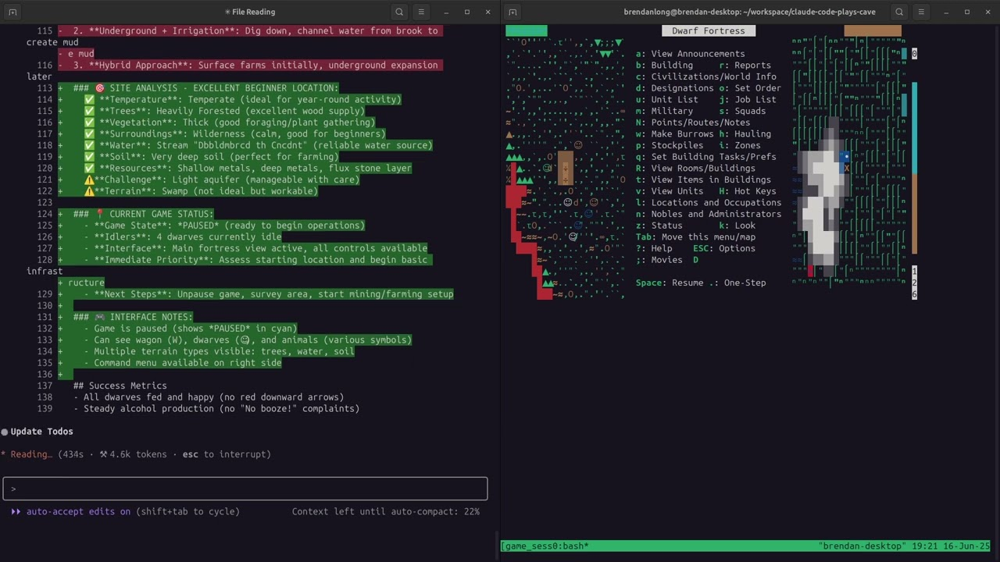

# Claude Plays Terminal Games

This project provides an MCP (Model Context Protocol) server that allows Claude to interact with terminal-based games through tmux. It enables Claude to play text-based games like Colossal Cave Adventure, NetHack, Zork, and other terminal games.

**Security note**: The `start_game` tool included in this repo can run arbitrary commands, so you probably don't want to give Claude unconditional permission to run it. The other commands are relatively safe to allow since they only work on whatever game is started, and the tmux session will end with it. This assumes you're running and actual game and not something like `bash` (in which case, `send_line` and `send_keys` can also run arbitrary commands).

## Examples

- **[Claude Playing Colossal Cave Adventure](https://youtu.be/ciDHtvSeZQE)** - Watch Claude explore the classic adventure game
- **[Claude Playing Dwarf Fortress](https://youtu.be/FLmPN03ZQbM)** - See Claude play Dwarf Fortress v0.47 in text mode ([setup guide](https://asciinema.org/a/723439))
  
  <a href="https://youtu.be/FLmPN03ZQbM">
    
  </a>

## Features

- **MCP Server**: Provides a clean API for Claude to interact with games
- **Terminal Game Support**: Works with any terminal-based game available in your PATH
- **Tmux Integration**: Uses tmux for reliable session management
- **Special Key Support**: Send complex key combinations and special keys
- **Game Notes**: Includes notes and guides for specific games

## Quick Start

1. **Install dependencies**:
   ```bash
   npm install
   ```

2. **Restart Claude Code** - it will automatically detect the `.mcp.json` file and load the game controller server!

## Available MCP Tools

- **`start_game`**: Start a new game session
  - Parameters: `game_name` (e.g., "adventure", "nethack")
  
- **`send_line`**: Send text commands to the game
  - Parameters: `command` (the command text)
  
- **`send_keys`**: Send special keys to the game
  - Parameters: `keys` (array of key names, e.g., ["Escape"], ["C-c"])
  
- **`read_output`**: Read the current game state/output
  
- **`end_game`**: Terminate the game session

## Supported Games

Any terminal-based game that can run in tmux, including:
- **Colossal Cave Adventure** (`adventure`)
- **NetHack** (`nethack`)
- **Zork** series (`zork1`, `zork2`, `zork3`)
- **Dwarf Fortress** (`dwarffortress`)
- And many more...

## Key Names Reference

Use these key names with the `send_keys` tool:
- Arrow keys: `Up`, `Down`, `Left`, `Right`
- Special keys: `BSpace`, `BTab`, `DC` (Delete), `End`, `Enter`, `Escape`, `Home`, `IC` (Insert), `Space`, `Tab`
- Page keys: `NPage`/`PageDown`, `PPage`/`PageUp`
- Function keys: `F1` to `F12`
- Modifiers: `C-` (Ctrl), `S-` (Shift), `M-` (Alt)
- Examples: `C-c` (Ctrl+C), `S-Tab` (Shift+Tab), `M-a` (Alt+A)

## Project Structure

```
claude-code-plays-text-games/
├── src/                   # Source code
│   ├── mcp-server.js      # Main MCP server
│   └── game-controller.js # Game interaction logic
├── scripts/               # Shell scripts for game interaction
│   ├── start_game.sh
│   ├── send_line.sh
│   ├── send_key.sh
│   ├── read_output.sh
│   └── end_game.sh
├── tests/                 # Test files and snapshots
│   ├── game-controller.test.js
│   └── __snapshots__/
├── game-notes/            # Game-specific notes and guides
│   └── dwarffortress/
├── CLAUDE.md              # Instructions for Claude
└── .mcp.json              # MCP server configuration
```

## Requirements

- Node.js
- tmux
- Game executables installed and available in PATH
- Claude Code with MCP support

## Testing

Run the test suite:
```bash
npm test
```

## Troubleshooting

- Use `/mcp` in Claude Code to check if the server is connected
- Ensure all game binaries are installed and in your PATH
- Check that tmux is installed and working
- Make sure you've run `npm install` to install dependencies
